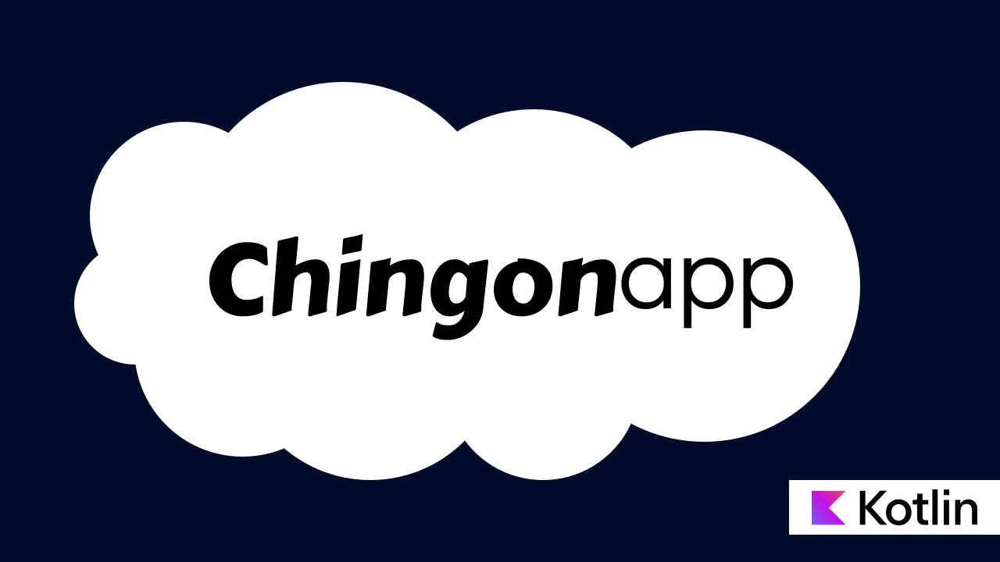
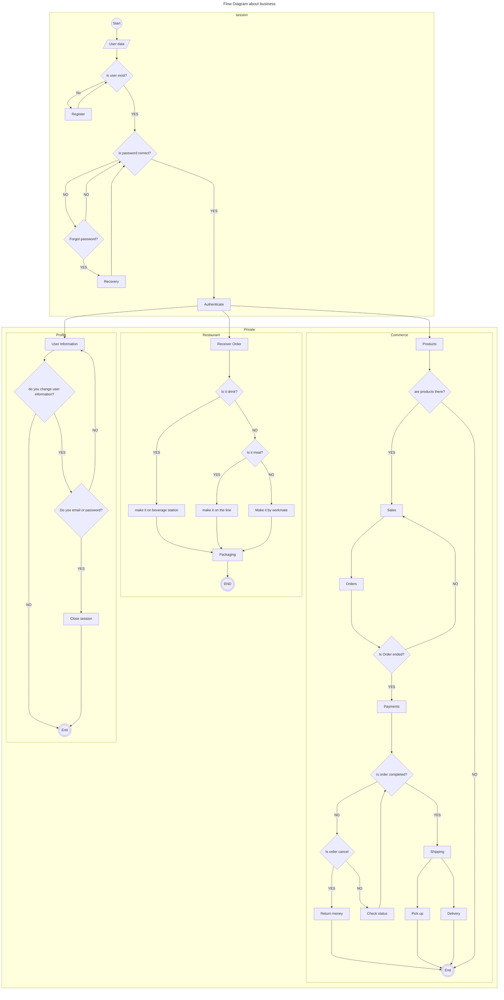
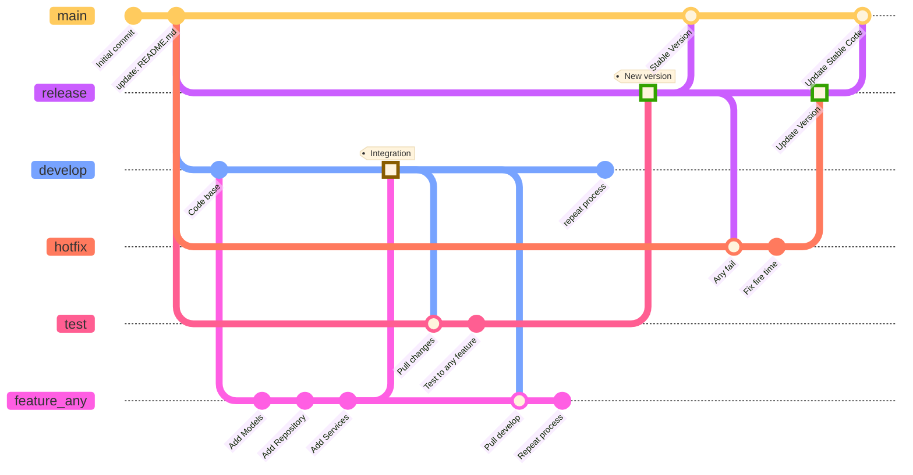

# Chingon API 

[](https://opensource.org/licenses/Apache-2.0)
[](https://github.com/Cessup/chingon-general-api-ktor/actions)
[](https://github.com/Cessup/chingon-general-api-ktor)



Chingon is an e-commerce platform. It's an API to different application that contain features to help you for make any applications.


> The project is also available [here](https://github.com/Cessup/chingon-general-api-ktor).
>
> The [`develop` branch](https://github.com/Cessup/chingon-general-api-ktor) showcase a stable version.
>

>I'm still developing it, so my plan is to create a system based on my knowledge, as I wanted to show you how I can create any system.
>If anyone needs help, I'd be happy to help.
>If you want to more information about me you can visit my website.
>- [cessup.com](https://www.cessup.com)

## Flow Diagram

This diagram shows the business model that exists in the system. It is a tool for understanding the business rules that exist.



## Pre-Requirements
Before your run, you need to have a mongo db can be local or remote. If you hava any mongo database you can configure that in application.yaml.

if you need more information about it you can check the next link
- [Mongo Documentation](https://www.mongodb.com)


## Features
Here's a list of features included in this project:

| Name                                                                                          | Description                                                                                           |
|-----------------------------------------------------------------------------------------------|-------------------------------------------------------------------------------------------------------|
| [Session](https://www.postman.com/cessupx/chingon-workspace/folder/goo6ezk/session-services)  | There are all services about session like sign in or sing up.                                         |
| [Product](https://www.postman.com/cessupx/chingon-workspace/folder/15fk1y4/products-services) | There are all services about products like insert, update, delete and every thing about products.     |
| [Eatable](https://www.postman.com/cessupx/chingon-workspace/folder/fjmlivp/eatable-services)  | There are all services about eatable like drinks or meals.                                            |
| [Sales](https://www.postman.com/cessupx/chingon-workspace/overview)                           | There are all services about sales like price or promotion. (It is in progress to do)                 |
| [Orders](https://www.postman.com/cessupx/chingon-workspace/overview)                          | There are all services about orders.                                                                  |
| [Payments](https://www.postman.com/cessupx/chingon-workspace/overview)                        | There are all services about payments like communication with the bank. (It is in progress to do)     |
| [Delivery](https://www.postman.com/cessupx/chingon-workspace/overview)                        | There are all services about delivery like pick-up, on the way and delivery.(It is in progress to do) |

## How to use it

If you want to use it you should check the next link because there is a workspace with all services by Postman.

- [Workspace](https://www.postman.com/cessupx/chingon-workspace/overview)

## Technologies

The app uses the following multiplatform dependencies in its implementation:

- [Ktor](https://ktor.io/) for networking
- [Koin](https://insert-koin.io) for dependency injection
- [MongoDB Driver](https://www.mongodb.com/docs/languages/kotlin/) It is to use the database

> The libraries are going to update when any project will absolute but before data we'll notify you. But you are free to use anything libraries in thins project because that is just a example.


## Building & Running

To build or run the project, use one of the following tasks:

| Task                          | Description                                                          |
| -------------------------------|---------------------------------------------------------------------- |
| `./gradlew test`              | Run the tests                                                        |
| `./gradlew build`             | Build everything                                                     |
| `buildFatJar`                 | Build an executable JAR of the server with all dependencies included |
| `buildImage`                  | Build the docker image to use with the fat JAR                       |
| `publishImageToLocalRegistry` | Publish the docker image locally                                     |
| `run`                         | Run the server                                                       |
| `runDocker`                   | Run using the local docker image                                     |

If the server starts successfully, you'll see the following output:

```
2025-07-22 17:10:27.080 [main] INFO  Application - Autoreload is disabled because the development mode is off.
2025-07-22 17:10:27.733 [main] INFO  org.mongodb.driver.client - MongoClient with metadata {"driver": {"name": "mongo-java-driver|reactive-streams|kmongo", "version": "4.11.0"}, "os": {"type": "Darwin", "name": "Mac OS X", "architecture": "x86_64", "version": "10.16"}, "platform": "Java/Oracle Corporation/15.0.2+7-27|Kotlin/2.1.20"} created with settings MongoClientSettings{readPreference=primary, writeConcern=WriteConcern{w=null, wTimeout=null ms, journal=null}, retryWrites=true, retryReads=true, readConcern=ReadConcern{level=null}, credential=null, transportSettings=null, streamFactoryFactory=null, commandListeners=[], codecRegistry=ProvidersCodecRegistry{codecProviders=[ProvidersCodecRegistry{codecProviders=[ValueCodecProvider{}, BsonValueCodecProvider{}, DBRefCodecProvider{}, DBObjectCodecProvider{}, DocumentCodecProvider{}, CollectionCodecProvider{}, IterableCodecProvider{}, MapCodecProvider{}, GeoJsonCodecProvider{}, GridFSFileCodecProvider{}, Jsr310CodecProvider{}, JsonObjectCodecProvider{}, BsonCodecProvider{}, EnumCodecProvider{}, com.mongodb.client.model.mql.ExpressionCodecProvider@f1dd5b4, com.mongodb.Jep395RecordCodecProvider@73809e7, com.mongodb.KotlinCodecProvider@5f96f6a2]}, org.litote.kmongo.service.CustomCodecProvider@48df4071, ProvidersCodecRegistry{codecProviders=[org.litote.kmongo.jackson.JacksonCodecProvider@290e8cab]}]}, loggerSettings=LoggerSettings{maxDocumentLength=1000}, clusterSettings={hosts=[localhost:27017], srvServiceName=mongodb, mode=SINGLE, requiredClusterType=UNKNOWN, requiredReplicaSetName='null', serverSelector='null', clusterListeners='[]', serverSelectionTimeout='30000 ms', localThreshold='15 ms'}, socketSettings=SocketSettings{connectTimeoutMS=10000, readTimeoutMS=0, receiveBufferSize=0, proxySettings=ProxySettings{host=null, port=null, username=null, password=null}}, heartbeatSocketSettings=SocketSettings{connectTimeoutMS=10000, readTimeoutMS=10000, receiveBufferSize=0, proxySettings=ProxySettings{host=null, port=null, username=null, password=null}}, connectionPoolSettings=ConnectionPoolSettings{maxSize=100, minSize=0, maxWaitTimeMS=120000, maxConnectionLifeTimeMS=0, maxConnectionIdleTimeMS=0, maintenanceInitialDelayMS=0, maintenanceFrequencyMS=60000, connectionPoolListeners=[], maxConnecting=2}, serverSettings=ServerSettings{heartbeatFrequencyMS=10000, minHeartbeatFrequencyMS=500, serverListeners='[]', serverMonitorListeners='[]'}, sslSettings=SslSettings{enabled=false, invalidHostNameAllowed=false, context=null}, applicationName='null', compressorList=[], uuidRepresentation=UNSPECIFIED, serverApi=null, autoEncryptionSettings=null, dnsClient=null, inetAddressResolver=null, contextProvider=null}
2025-07-22 17:10:27.750 [cluster-ClusterId{value='68800c53c8d03b1550000000', description='null'}-localhost:27017] INFO  org.mongodb.driver.cluster - Monitor thread successfully connected to server with description ServerDescription{address=localhost:27017, type=STANDALONE, state=CONNECTED, ok=true, minWireVersion=0, maxWireVersion=25, maxDocumentSize=16777216, logicalSessionTimeoutMinutes=30, roundTripTimeNanos=16577885}
2025-07-22 17:10:27.765 [main] INFO  Application - Application started in 0.926 seconds.
2025-07-22 17:10:27.921 [DefaultDispatcher-worker-1] INFO  Application - Responding at http://0.0.0.0:8080
```


## Development
This project is not finished, and this repository helps continue the project's development. Below is the standard to follow for new features.


